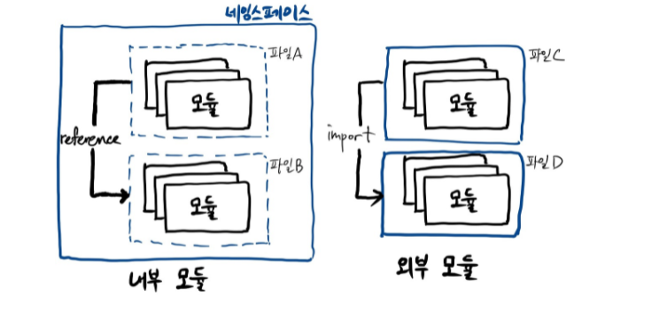
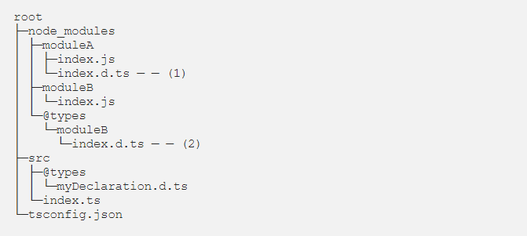
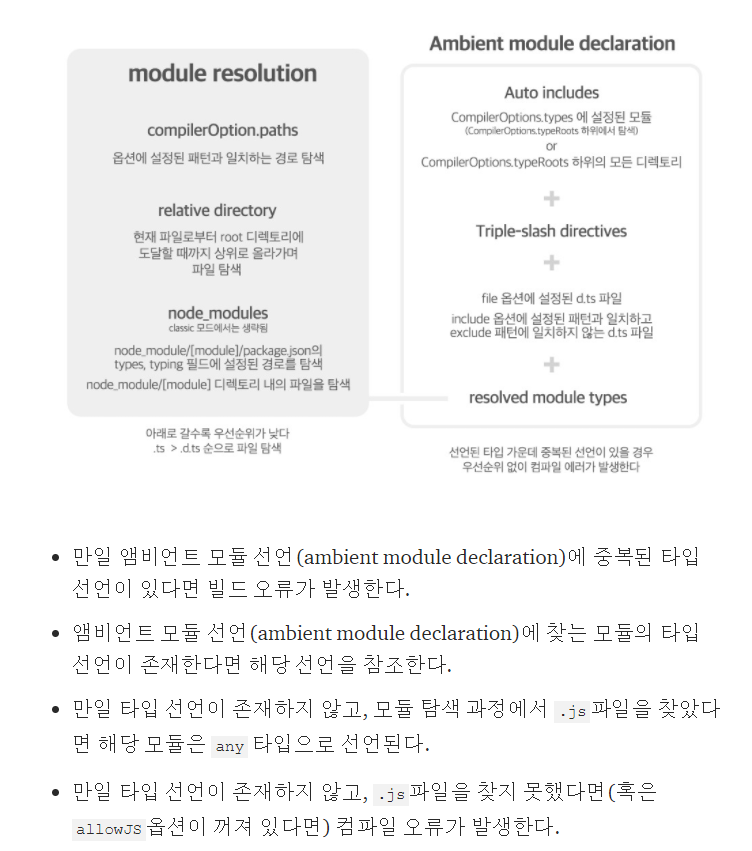

# 타입스크립트 컴파일러가 타입 선언을 참조하는 과정
자바스크립트로 된 파일을 타입스크립트에 사용하기 위해선 타입을 참조하기 위한 타입 선언 파일이 필요하다.<br/>
타입스크립트 컴파일러가 컴파일러 옵션에 따라서 타입 선언 파일을 참조하는 과정을 알아보겠습니다.

## 타입스크립트 컴파일러란?
타입스크립트를 특정 타켓 버전의 자바스크립트로 컴파일 해주는 컴파일러입니다.

작동 순서
- 타입스크립트로 작성된 소스코드를 AST로 변환
- 타입체커가 AST를 확인
- AST를 자바스크립트 소스코드로 변환

## 타입 선언 파일(.d.ts)이란?
타입 선언코드만 모여있는 파일로써 컴파일러에게 모듈의 타입을 알려주기 위해서 타입 선언 파일이 필요한다.<br/>

### declare 키워드
컴파일러에게 해당 변수나 함수가 이미 존재한다는 것을 알리는 역할을 한다.<br />
컴파일러는 코드의 정적 타입 확인을 위해 사용할 뿐 자바스크립트로 컴파일하지 않습니다.<br />
(allowJs 옵션이 켜져있을 경우 필요없음)
```javascript
// moduleA
export const object = {
  name: "Camel",
  age: 28
}
```
```typescript
// moduleA.d.ts
export declare let object2: { name: string, age: number }

// index.ts
import { object1 } from "./moduleA"

object2.name = "Kim"
```

### declare namespace Module_Name
<br />
내부 모듈인 네임스페이스는 전역 이름공간과 분리된 네임스페이스 단위의 이름공간이다.<br />
따라서 같은 네임스페이스의 이름 공간이라면 파일 B가 파일 A에 선언된 모듈을 참조(reference)할 수 있는데 참조할 때는 별도의 참조문을 선언할 필요가 없다. <br />
같은 네임스페이스 안에서는 이름을 중복해서 클래스, 함수, 변수 등을 선언할 수 없다. 하지만 다른 네임스페이스 간에는 이름이 같아도 충돌이 없다.
```typescript
//moduleA
namespace moduleA {
  export let a: string = 'a'
}

//moduleB
namespace moduleA {
  export let b: string = 'b'
}

//index.ts
/// <reference path="./moduleB.ts" />
/// <reference path="./moduleA.ts" />
moduleA.a = "123"
moduleA.b = "123"
```
```javascript
//moduleA
var module;
(function (module) {
    module.a = 'a';
})(module || (module = {}));

//moduleB
var moduleA;
(function (moduleA) {
  moduleA.b = 'b';
})(moduleA || (moduleA = {}));
```
```typescript
declare namespace moduleA {
  export let a: string
}
```
### declare global
모듈 파일에서 전역 참조가 가능한 선언코드를 작성하고 싶을 때 사용한다.
```typescript
declare global {
  interface Window {
    ENV: string
  }
}
```
### declare module "Module_Name" 
앰비언트 모듈 선언 파일에 작성하는 블록으로, 앰비언트 모듈 혹은 외부 모듈이라고 부릅니다.<br/>
이 파일은 컴파일 대상에 포함되기만 한다면 그곳에 선언된 모듈의 타입 정보를 참조할 수 있게된다.
```typescript
declare module "moduleA" {
  export let a: string
}
```
## 타입스크립트 모듈 탐색 방식
타입 선언 파일을 찾는 과정은 모듈을 불러오는 방식에 따라 다릅니다.
```typescript
import modulename from './modulename'; // relative module import
import modulename from 'modulename'; // non-relative module import
```
### 상대경로 모듈 불러오기
컴파일러는 구문이 작성된 파일을 기준으로 주어진 경로에 존재하는 .ts, .d.ts파일을 탐색한다.<br />
해당 위치에 파일이 존재하지 않으면 컴파일 오류가 발생한다.

### 비 상대경로 모듈 불러오기
1. 모듈명이 compilerOptions.paths 옵션에 설정된 패턴과 일치할 경우, 해당 경로를 탐색한다. (설정에 있는 경우)
2. 현재 파일이 위치한 디렉토리에서 node_modules 폴더 안의 파일을 탐색한다.
3. node_module/[module]/package.json의 main, types, typing 필드에 설정된 경로를 탐색한다.
4. node_module/[module] 디렉토리 내의 파일을 탐색한다.
5. baseUrl 옵션에 도달할 때 까지 상위 디렉토리로 올라가며 파일을 탐색한다.
6. baseUrl까지 타입 선언 파일을 찾지 못하면 컴파일 시에 포함되어있는 앰비언트 모듈 선언 목록에서 타입을 참조한다.

## 컴파일 시점에 포함되는 파일

1.imported module
```typescript
// moduleA.d.ts
declare module "moduleA"{
  const object: {
    name: string
    age: number
  }
}

// index.ts
import "./moduleA"
import { object } from "moduleA"
```
2.triple-slash directives<br/>
파일 간 의존성 선언으로 컴파일 프로세스에 추가적인 파일을 포함하도록 컴파일러에게 지시한다.
```typescript
/// <reference path=”./mymodule.d.ts” /> 
/// <reference types=”mymodule” /> 
```
3.컴파일러 설정에 포함되어있는 파일
```json
{
 "compilerOptions": {
 // config 파일에서 설정하는 다른 경로 관련 옵션에 상대경로를 입력할 경우의 root 디렉토리를 지정한다.
 "baseUrl": ".",
 // 디렉토리 경로 문자열을 지정한다.
 // 1. <reference types=”…” />와 types옵션에서 모듈 선언을 탐색할 때 기본 디렉토리 역할을 한다.
 // 2. 해당 옵션에 지정된 경로 하위 모든 폴더는 컴파일시에 자동 포함됩니다.
 // 3. 포함되는 것은 폴더임으로 module/index.d.ts가 없다면 컴파일 오류가 발생한다.
 "typeRoots": [],
 // 모듈명을 지정한다. 이 옵션이 설정되어 있으면 typeRoots의 자동포함은 동작하지 않습니다.  
 "types": []
 },
// 포함하고자 하는 파일의 경로르 입력한다.(확장자까지 필요)  
 "files": [],
// 파일패턴이나 와일드카드 입력이 가능하고 확장자를 입력하지 않는 경우 디렉토리 아래의 모든 파일을 포함한다. 
 "include": [],
// include에서 제외할 패턴을 지정한다.  
 "exclude": []
}
```
## 실습

```typescript
// index.ts
import moduleA from "moduleA"
```
```json
{
 "compilerOptions": {
  "baseUrl": ".",
   "paths": {
     "moduleA": ["./src/@types/myDeclaration.d.ts"]
   }
 }
}
```
1. 컴파일러는 index.ts에서 non-relative module import구문을 발견하여 moduleA모듈에 대한 타입 선언 파일을 탐색하기 시작한다.
2. compilerOptions.path에 moduleA에 대한 경로 설정이 존재하므로 해당 경로를 우선 탐색한다.
3. 경로에서 .d.ts파일을 찾았으므로 탐색을 종료하고, myDeclaration.d.ts파일 내의 모듈 타입 선언을 앰비언트 모듈 선언 목록에 추가한다.

```typescript
// index.ts
import moduleB from "moduleB"
```
```json
{
 "compilerOptions": {
  "baseUrl": ".",
   "paths": {
     "moduleB": ["./src/@types/myDeclaration.d.ts"]
   },
   "types": []
 }
}
```
1. compilerOptions.types에 값이 지정되었으므로, node_modules/@types디렉토리 내의 모듈에 대한 자동 포함이 동작하지 않는다.
2. 이 다음은 moduleA를 불러올 때와 동일하게 동작한다.

만일 types에 값이 지정되지 않는다면 node_modules/@types 아래의 moduleB에 대한 타입 선언이 자동으로 포함되어 중복 선언 컴파일 에러가 발생할 것이다.

## 마무리겸 주의사항
typescript 버전이 올라가고 기본 module 옵션이 classic에서 node로 바뀜에 따라 컴파일러가 모듈을 찾는 방식이 바뀌었다. <br/>
