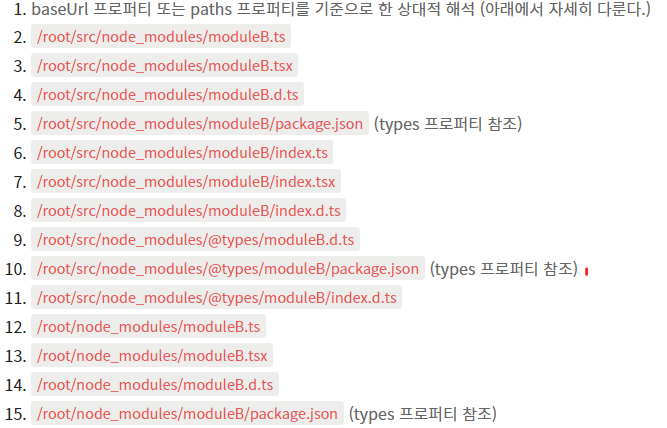

# 타입스크립트 컴파일러가 타입 선언을 참조하는 과정
자바스크립트로 된 작성된 라이브러리를 타입스크립트에 사용하기 위해선 타입을 참조하기 위한 타입 선언 파일이 필요합니다.
타입스크립트 컴파일러가 이 타입 선언 파일을 어떠한 경로를 통해서 참조를하는지 그 과정을 알아보겠습니다.
```bash
yarn install styled-components

yarn install @types/styled-components
```
```typescript
// node_modules/@types/styled-components/index.d.ts
export type CSSProperties = CSS.Properties<string | number>;

export type CSSPseudos = { [K in CSS.Pseudos]?: CSSObject };

export interface CSSObject extends CSSProperties, CSSPseudos {
  [key: string]: CSSObject | string | number | undefined;
}
...types
```
<br />

## 타입스크립트 컴파일러란?
타입스크립트를 특정 타켓 버전의 자바스크립트로 컴파일 해주는 컴파일러입니다.

작동 순서
- 타입스크립트로 작성된 소스코드를 AST로 변환
- 타입체커가 AST를 확인
- AST를 자바스크립트 소스코드로 변환
  
<br />
  
## 타입 선언 파일(.d.ts)이란?
타입 선언코드만 모여있는 파일로써 컴파일러에게 모듈의 타입을 알려주기 위해서 타입 선언 파일이 필요한다.<br/>
컴파일 시에 자바스크립트 파일로 변환되지 않는다.

### declare 키워드
컴파일러에게 해당 변수나 함수가 이미 존재한다는 것을 알리는 역할을 한다.<br />
컴파일러는 코드의 정적 타입 확인을 위해 사용할 뿐 자바스크립트로 컴파일되지 않습니다.<br />
```typescript
// @types/styled-components/index.d.ts
declare const styled: StyledInterface;

export default styled

//index.ts
import styeld from "styled-components"
````
**※ tsconfig.json이 없는 시절에 컴파일에 포함할 파일들을 알려주기위해서 사용했습니다.**
```typescript
// moduleA.d.ts
declare let AString: string;

//index.ts
/// <reference path="./moduleA.d.ts" /> -> 타입스크립트 컴파일러 참조자
AString = "string"
````
**※ module-loader와 tsconfig.json이 생기고 부터는 사실상 declare 키워드는 필요가 없습니다.**
```typescript
// @types/styled-components/index.d.ts
const styled: StyledInterface;

export default styled

//index.ts
import styeld from "styled-components"
````
<br />

### 1. declare global 블록
모듈 파일에서 전역 참조가 가능한 선언코드를 작성하고 싶을 때 사용합니다.
```typescript
declare global {
  interface Window {

   history: any
  }
}
```
<br />

### 2. declare namespace Module_Name 블록
내부 모듈인 네임스페이스는 전역 이름공간과 분리된 네임스페이스 단위의 이름공간입니다.<br />
따라서 같은 네임스페이스의 이름 공간이라면 파일 B가 파일 A에 선언된 모듈을 참조(reference)할 수 있는데 참조할 때는 별도의 참조문을 선언할 필요가 없습니다. <br />
같은 네임스페이스 안에서는 이름을 중복해서 클래스, 함수, 변수 등을 선언할 수 없다. 하지만 다른 네임스페이스 간에는 이름이 같아도 충돌이 없습니다.
```typescript
//moduleA.ts
namespace name {
  export let a: string = 'a'
}

//moduleB.ts
namespace name {
  console.log(a)
}
```
아래와 같이 네임스페이스를 컴파일 한 결과물을 보면 즉시호출함수를 이용한 것을 볼 수 있습니다.<br />
내부모듈은 컴파일된 JS에서 module-loader에 의존하지 않기 때문에 전역스코프에 오프젝트로 명명됩니다.
이는 글로벌 네임스페이스를 망칠 수도 있으며, 규모가 클수록 식별하기 어려워져서 module-loader를 쓰는게 더 좋습니다.
```javascript
//moduleA.js
var name;
(function (name) {
    name.a = 'a';
})(name || (name = {}));

//moduleB.js
var name;
(function (name) {
  console.log(name.a);
})(name || (name = {}));

//something.html
<script src="moduleA.js" type="text/javascript" />
<script src="moduleB.js" type="text/javascript" />
```
타입선언 파일에서도 마찬가지로 네임스페이스를 활용할 수 있습니다.
```typescript
// name.d.ts
export declare namespace name {
  
}

```
<br />

### 3. declare module "Module_Name" 블록
앰비언트 모듈 이라고 부릅니다. 이 파일은 컴파일 대상에 포함될 경우 앰비언트 모듈 선언 목록에 추가됩니다. <br/>
비 상대경로 모듈을 사용할 경우, 타입 참조에 이용됩니다.
```typescript
//index.d.ts
declare module "moduleA" {
  export let a: string
}

//index.ts
import { a } from "moduleA"
```
<br />

## 타입스크립트 모듈 탐색 방식(Node)
타입 선언 파일을 찾는 과정은 모듈을 불러오는 방식에 따라 다릅니다.
```typescript
import modulename from './modulename'; // relative module import
import modulename from 'modulename'; // non-relative module import
```
### 상대경로 모듈 불러오기
컴파일러는 구문이 작성된 파일을 기준으로 주어진 경로에 존재하는 .ts, .d.ts파일을 탐색한다.<br />
해당 위치에 파일이 존재하지 않으면 컴파일 오류가 발생한다.

### 비 상대경로 모듈 불러오기
1. 모듈명이 compilerOptions.paths 옵션에 설정된 패턴과 일치할 경우, 해당 경로를 탐색한다. (설정에 있는 경우)
2. 현재 파일이 위치한 디렉토리에서 node_modules 폴더 안의 파일을 탐색한다.
3. node_module/[module]/package.json의 types 필드에 설정된 경로를 탐색한다.
4. node_module/[module] 디렉토리 내의 파일을 탐색한다.
5. baseUrl 옵션에 도달할 때 까지 상위 디렉토리로 올라가며 파일을 탐색한다.
6. baseUrl까지 타입 선언 파일을 찾지 못하면 컴파일 시에 포함되어있는 앰비언트 모듈 선언 목록에서 타입을 참조한다.

### 예시

<br />
<br />

## 컴파일 시점에 포함시키는 방법

### 1.imported module
```typescript
// moduleA.d.ts
declare module "moduleA"{
  const object: {
    name: string
    age: number
  }
}

// index.ts
import "./moduleA"
import { object } from "moduleA"
```
<br />

### 2.triple-slash directives<br/>
패키지 혹은 파일 간 의존성 선언으로 컴파일 프로세스에 추가적인 파일을 포함하도록 컴파일러에게 지시한다.
```typescript
/// <reference path=”./mymodule.d.ts” /> 파일
/// <reference types=”mymodule” />  패키지 (mymodule/index.d.ts or package.json)
```
※ tsconfig.json이 없는 시절에 컴파일에 포함할 파일들을 알려주기위해서 사용했습니다.
<br />
<br />

### 3.컴파일러 설정에 포함되어있는 파일
```json
{
 "compilerOptions": {
 "baseUrl": ".",
 "typeRoots": ["./typings"],
 "types": ["node", "lodash", "express"]
 },
 "include": ["src"],
 "exclude": ["src"]
}
```
- baseUrl
  1. config 파일에서 설정하는 다른 경로 관련 옵션에 상대경로를 입력할 경우의 root 디렉토리를 지정합니다.
  
- typeRoots
  1. 디렉토리 경로 문자열을 지정합니다.
  2. <reference types=”…” />와 types옵션에서 모듈 선언을 탐색할 때 기본 디렉토리 역할을 합니다.
  3. 해당 옵션에 지정된 경로 하위 모든 패키지는 컴파일시에 자동 포함됩니다.
    
- types
  1. 패키지명을 지정합니다. 이 옵션이 설정되어 있으면 typeRoots의 자동포함은 동작하지 않습니다.
- include
  1. 파일패턴이나 와일드카드 입력이 가능하고 확장자를 입력하지 않는 경우 디렉토리 아래의 모든 파일을 포함합니다.
- exclue
  1. include에서 제외할 패턴을 지정합니다.

※ exclude에 포함시키거나 여러 옵션들에 특정 파일을 넣지 않더라도 import 시킨다면 컴파일 시점에 포함됨으로 주의해야됩니다.